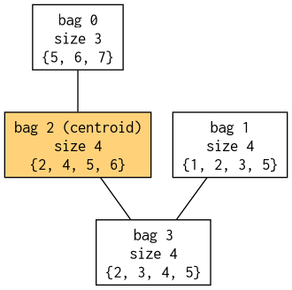

# Tree Decomposition library

This is a library that's useful for doing tree decompositions. I have been
using these tools for my tool [Ganak](https://github.com/meelgroup/ganak/), but
I want to use it in more projects. Now it's a library.

## Authors

* Ben Strasser -- original FlowCutter library
* Tuukka Korhonen and Matti Jarvisalo -- graph libraries
* Kenji Hashimoto -- graph libraries

## Standalone `treedecomp` binary

Alongside the library, `build/treedecomp` is a CLI that reads a CNF on stdin
(or a file), builds the primal graph (one edge between every pair of variables
that share a clause), runs FlowCutter, and prints a per-variable tree
decomposition score — the same score ganak uses internally to bias branching.

### Input

Standard DIMACS CNF:

```
p cnf <nvars> <nclauses>
2 30 0
-1 4 5 0
...
```

### Output

Comment lines prefixed with `c` (parse stats and the TD width), followed by
one line per variable on stdout in the form:

```
<var> <tdscore>
```

The **first column is the variable** (1-indexed, matching the CNF numbering).
The **second column is its tree-decomposition score, in the range `0..100`** —
higher means the variable is closer to the centroid of the tree
decomposition (this is the `compute_td_score_using_raw` path from ganak's
`counter.cpp`).

### Example

A small CNF with a mix of ternary clauses:

```
$ cat example.cnf
p cnf 7 8
1 2 3 0
2 3 4 0
3 4 5 0
-4 5 6 0
5 6 7 0
-1 3 5 0
2 4 6 0
-5 -6 7 0

$ ./build/treedecomp --tdvis example.dot example.cnf
c parsed nvars=7 clauses=8
c primal nodes=7 edges=13 density=0.265306 edge/var=1.85714
c TD width: 3
c centroid bag: 2
c wrote DOT file: example.dot (render: dot -Tpdf example.dot -o td.pdf)
1 0
2 100
3 50
4 100
5 100
6 100
7 50
```

Each output line is `<variable> <score>`: column 1 is the CNF variable id
(1-indexed), column 2 is its TD score in `0..100`. Higher means the
variable sits closer to the centroid of the tree decomposition — in this
run, vars 2, 4, 5, 6 are central (score 100), vars 3 and 7 are one step
out, and var 1 is farthest (score 0).

Passing `--tdvis <file>` writes the tree decomposition as a Graphviz DOT
file, with one node per bag (labeled with its size and the CNF variables it
contains). Render it to an image with:

```
$ dot -Tpng example.dot -o example.png
```

The resulting tree for the CNF above has 4 bags of width 3 (i.e. 4
variables each); bag 2 `{2, 4, 5, 6}` is reported as the centroid and is
highlighted in the rendered graph:



### Usage

```
./treedecomp input.cnf              # read from file
./treedecomp < input.cnf            # read from stdin
./treedecomp --tditers 300 input.cnf
```

### Options

Cutoffs and tuning knobs mirror ganak's `conf.td_*` settings so results line
up with what ganak computes on the same instance:

| flag | meaning |
| --- | --- |
| `--tdsteps N`        | FlowCutter max steps (default 100000) |
| `--tditers N`        | FlowCutter iterations / restarts (default 900) |
| `--tdmaxedges N`     | skip TD if primal has more than N edges |
| `--tdmaxdensity F`   | skip TD if primal density > F |
| `--tdmaxedgeratio N` | skip TD if edge/var ratio > N |
| `--tdvarlim N`       | skip TD if #vars > N |
| `--tdcontract 0/1`   | contract high-numbered vars before running TD |
| `--tdvis FILE`       | write the tree decomposition as a Graphviz DOT file |
| `-v N`               | verbosity |

The binary links against the `treedecomp` library and uses `argparse.hpp` for
option parsing.

# Notes

Basically, if you find a bug, it's likely been introduced by me. Just open an
issue and I'll fix.
